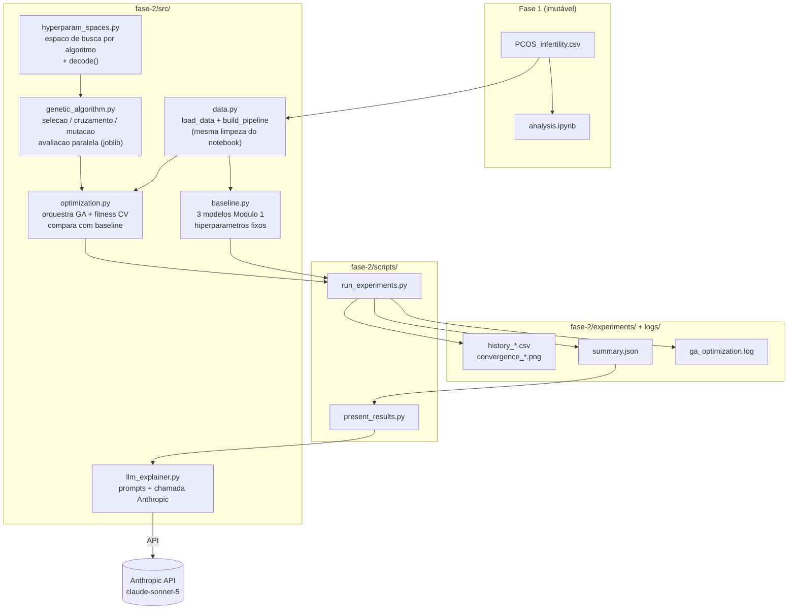
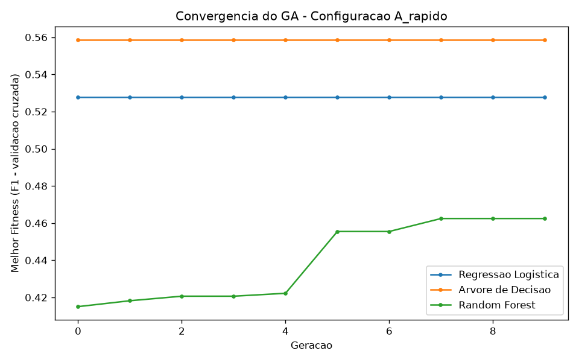
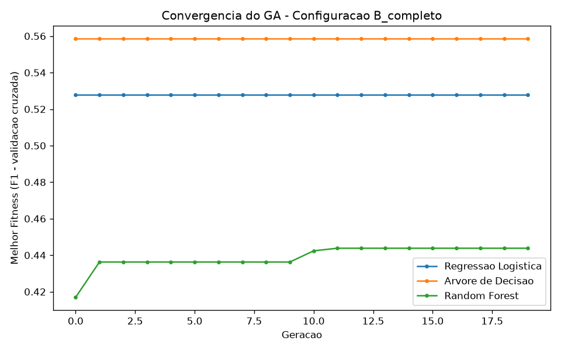
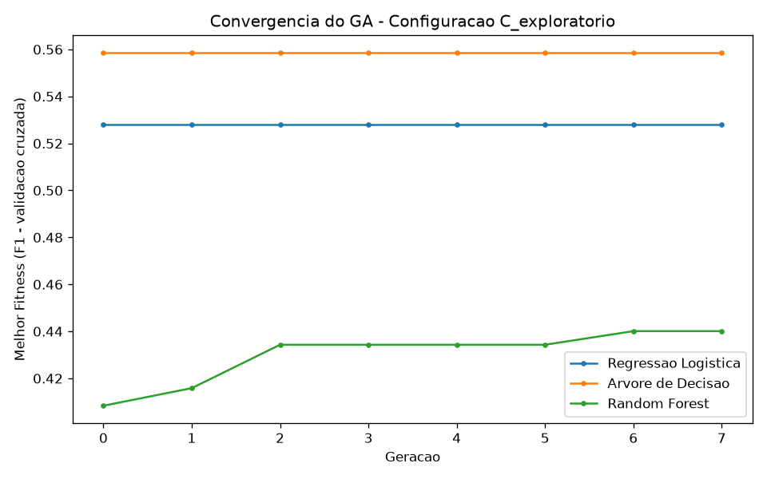

# Relatório Técnico — Fase 2, Projeto 1: Otimização de Modelos de Diagnóstico

**Tech Challenge FIAP PosTech — Fase 2**
**Autor:** Nicolas Gomes
**Data:** Agosto de 2026

---

## 1. Contexto e Objetivo

Na Fase 1 (ver [`../RELATORIO.md`](../RELATORIO.md)), três modelos de Machine Learning foram treinados para detecção de PCOS a partir de 3 biomarkers hormonais (AMH, beta-HCG I, beta-HCG II): Regressão Logística, Árvore de Decisão e Random Forest, todos com hiperparâmetros fixados manualmente.

Este relatório documenta a Fase 2, Projeto 1: otimização desses hiperparâmetros via **algoritmo genético (GA)**, e a integração de uma **LLM (Anthropic Claude)** para traduzir os resultados em linguagem clínica para profissionais de saúde.

### 1.1 Arquitetura do Sistema



**Fluxo:** `run_experiments.py` treina o baseline (`baseline.py`), roda 3 configurações de GA (`genetic_algorithm.py` + `hyperparam_spaces.py`, orquestrado por `optimization.py`) para os 3 algoritmos, e persiste histórico/gráficos/resumo em `experiments/` e log em `logs/`. `present_results.py` lê esse resumo, formata para o vídeo de demonstração e, se houver `ANTHROPIC_API_KEY`, chama `llm_explainer.py` para gerar explicações clínicas ao vivo. A fitness do GA (`optimization.py`) nunca toca o conjunto de teste — só `X_train` via validação cruzada (ver Seção 2.3).

---

## 2. Algoritmo Genético — Implementação

### 2.1 Codificação (representação de genes)

Cada indivíduo é um cromossomo — um dicionário `gene_name -> valor` — específico por algoritmo. Os genes correspondem diretamente aos hiperparâmetros relevantes de cada modelo (`src/hyperparam_spaces.py`):

| Algoritmo | Genes |
|---|---|
| Regressão Logística | `C` (float, 0.001–100), `penalty` (l1/l2), `class_weight` (None/balanced) |
| Árvore de Decisão | `max_depth` (1–20), `min_samples_split` (2–20), `min_samples_leaf` (1–10), `criterion` (gini/entropy) |
| Random Forest | `n_estimators` (50–300), `max_depth` (1–30), `min_samples_split` (2–20), `min_samples_leaf` (1–10), `max_features` (sqrt/log2/None) |

O `solver` da Regressão Logística não é um gene independente: é derivado do `penalty` escolhido (`l1 -> liblinear`, `l2 -> lbfgs`) em `decode()`, garantindo que combinações inválidas nunca sejam representáveis.

### 2.2 Operadores genéticos (`src/genetic_algorithm.py`)

- **Seleção:** torneio — `k` indivíduos amostrados aleatoriamente, vence o de maior fitness.
- **Cruzamento:** uniforme — cada gene do filho é herdado independentemente de um dos dois pais (probabilidade 50%), controlado por uma taxa de cruzamento.
- **Mutação:** cada gene é re-amostrado de todo o seu domínio com probabilidade igual à taxa de mutação (não é uma perturbação local — favorece exploração dado o espaço de busca pequeno).
- **Elitismo:** o(s) melhor(es) indivíduo(s) de cada geração passa(m) direto para a próxima, garantindo que o fitness nunca regride.

### 2.3 Função fitness — decisão metodológica importante

A fitness é o **F1-score médio de validação cruzada (5-fold) calculado apenas sobre o conjunto de treino** (`X_train`), nunca sobre o conjunto de teste. Isso evita vazamento de informação: se a busca de hiperparâmetros "visse" o conjunto de teste, a comparação final contra o baseline seria enviesada. O conjunto de teste (mesmo split, mesmo `random_state=42` do notebook da Fase 1) é usado **apenas** para a avaliação final baseline-vs-otimizado, replicando exatamente a metodologia da Fase 1.

F1 foi escolhido por consistência com o critério de seleção do campeão já usado no notebook da Fase 1 (não introduz um critério novo/arbitrário). Accuracy e Recall são reportados lado a lado para leitura clínica completa.

---

## 3. Três Experimentos com Configurações Diferentes

| Configuração | População | Gerações | Taxa de Mutação | Taxa de Cruzamento | Torneio |
|---|---|---|---|---|---|
| **A — rápido** | 15 | 10 | 10% | 80% | 3 |
| **B — completo** | 30 | 20 | 5% | 90% | 4 |
| **C — exploratório** | 10 | 8 | 35% | 70% | 2 |

Cada configuração foi executada para os 3 algoritmos (9 execuções de GA no total). Fitness (F1 via CV, 5-fold, sobre treino) por geração:





Históricos completos (geração, melhor, média, desvio-padrão) em `experiments/history_*.csv`.

**Observação relevante:** para Regressão Logística e Árvore de Decisão, as 3 configurações convergiram para exatamente o mesmo hiperparâmetro ótimo (ver Seção 4). Isso não é um bug — o espaço de busca desses dois algoritmos é pequeno e dominado por um sinal forte (`class_weight="balanced"` para Regressão Logística; profundidade rasa para Árvore de Decisão), então qualquer configuração razoável de GA o encontra rapidamente. O Random Forest, com um espaço de busca maior (5 genes, faixas contínuas mais amplas) e poucas gerações (8–20), mostrou-se sensível à configuração — cada experimento convergiu para uma profundidade/número de árvores diferente.

---

## 4. Comparação: Modelos Originais vs. Otimizados

Métricas no conjunto de teste (mesmo split da Fase 1, `random_state=42`, nunca usado para calcular fitness do GA):

### Baseline (Fase 1, hiperparâmetros fixos)

| Modelo | Accuracy | Recall | F1-Score |
|---|---|---|---|
| Regressão Logística | 0,6422 | 0,1111 | 0,1702 |
| Árvore de Decisão | 0,6881 | 0,2778 | 0,3704 |
| Random Forest | 0,6606 | 0,3889 | 0,4308 |

### Melhor configuração de GA por algoritmo

| Modelo | Config. | F1 (antes → depois) | Recall (antes → depois) | Hiperparâmetros otimizados |
|---|---|---|---|---|
| **Regressão Logística** | A_rapido | 0,1702 → **0,4242** (+0,2540) | 0,1111 → 0,3889 (+0,2778) | `C=63.94, penalty=l1, class_weight=balanced` |
| **Árvore de Decisão** | A_rapido | 0,3704 → **0,4507** (+0,0803) | 0,2778 → 0,4444 (+0,1667) | `max_depth=1, min_samples_split=7, min_samples_leaf=7, criterion=entropy` |
| Random Forest | C_exploratorio | 0,4308 → 0,3810 (−0,0498) | 0,3889 → 0,3333 (−0,0556) | `n_estimators=297, max_depth=26, min_samples_split=15, min_samples_leaf=6, max_features=None` |

### Leitura dos resultados

- **Regressão Logística — maior ganho:** o baseline usava os hiperparâmetros default do sklearn (`class_weight=None`), o que faz o modelo ignorar o desbalanceamento de classes (67%/33%) e praticamente nunca prever "Com PCOS" (Recall original de apenas 0,11!). O GA descobriu `class_weight="balanced"`, que por si só resolve a maior parte do problema — o Recall mais que triplicou.
- **Árvore de Decisão — ganho moderado:** o GA encontrou um *decision stump* (`max_depth=1`) que generaliza melhor que a árvore de profundidade 5 do baseline. Com apenas 3 features e 541 amostras, uma árvore mais profunda tende a decorar ruído (overfitting) — o resultado é consistente com a teoria.
- **Random Forest — única regressão, e por um motivo identificável:** o baseline usa `max_depth=None` (árvores totalmente expandidas), mas o espaço de busca do GA limita `max_depth` a no máximo 30 — mesmo a configuração que mais se aproximou (profundidade 26) não alcançou o baseline. Essa é uma limitação de **escopo da busca**, não do algoritmo genético em si: o GA convergiu de forma consistente (fitness nunca regride, por elitismo) para o melhor ponto *dentro do espaço definido*, mas esse espaço não incluía a opção que o baseline usava. Fica documentado como limitação conhecida (Seção 7) e não foi "escondido" ajustando o espaço de busca depois de ver o resultado.

---

## 5. Monitoramento e Escalabilidade

- **Logging:** cada execução do GA registra, por geração, `best`/`mean`/`std` de fitness em `logs/ga_optimization.log` (`src/genetic_algorithm.py`, via módulo `logging` padrão do Python).
- **Histórico estruturado:** `scripts/run_experiments.py` salva um CSV por combinação configuração×algoritmo em `experiments/` e um gráfico de convergência por configuração (`experiments/convergence_*.png`).
- **Escalabilidade automática:** a avaliação de fitness de cada geração é paralelizada entre os núcleos disponíveis via `joblib.Parallel` (backend `loky`) em `src/genetic_algorithm.py`. Isso escala automaticamente com o hardware disponível — de 1 núcleo a dezenas — sem código adicional.
- **Nota sobre nuvem:** a implementação de infraestrutura em nuvem foi deliberadamente deixada de fora do escopo (opcional/pontuação extra, conforme o enunciado). Em produção, o mesmo `fitness_fn` poderia ser distribuído por um pool de workers gerenciado (ex.: AWS Batch, Ray, ou um cluster Dask) sem alterar a lógica do GA — a única mudança seria o backend do `joblib.Parallel`.

---

## 6. Integração com LLM (`src/llm_explainer.py`)

### 6.1 Abordagem

Duas funções de explicação, ambas usando a API da Anthropic (modelo `claude-sonnet-5`):

1. **`explain_diagnosis`** — dado um paciente (biomarkers), a predição do modelo e o biomarker de maior impacto (SHAP), gera uma explicação clínica estruturada.
2. **`explain_optimization`** — dado o resultado da otimização (métricas antes/depois, configuração do GA), gera um resumo em linguagem natural para gestores hospitalares.

### 6.2 Prompt engineering

O `system prompt` fixa 4 seções obrigatórias (Resumo, Fatores Determinantes, Recomendação, Limitações) e exige que a resposta sempre termine com o aviso de que a ferramenta é de apoio, não substitui o profissional de saúde. A construção do prompt (`build_diagnosis_prompt`/`build_optimization_prompt`) é pura — não depende de rede — o que permite testá-la isoladamente (`tests/test_llm_explainer.py`).

### 6.3 Avaliação da qualidade

Como qualidade de texto gerado por LLM é inerentemente não-determinística, ela não é validada por asserção exata em teste automatizado. A avaliação foi feita manualmente com um checklist fixo, aplicado a uma chamada real de `scripts/present_results.py` (modelo `claude-sonnet-5`, `ANTHROPIC_API_KEY` configurada em `.env`):

**Checklist — `explain_diagnosis` (paciente de exemplo) e `explain_optimization` (Random Forest):**

- [x] Menciona o biomarker de maior impacto (SHAP)? — sim, ambas citam AMH explicitamente e explicam seu papel clínico.
- [x] Contém as 4 seções obrigatórias (Resumo, Fatores Determinantes, Recomendação, Limitações)? — sim, nas duas respostas.
- [x] Termina com o aviso "ferramenta de apoio"? — sim, nas duas respostas.
- [x] Evita afirmar certeza absoluta no diagnóstico? — sim ("não deve ser interpretada como certeza diagnóstica", "não estabelece causalidade").

**Exemplo real — `explain_diagnosis`** (paciente sintética: AMH=8.2, beta-HCG I=1.1, beta-HCG II=0.5, predição "Com PCOS", probabilidade 87%):

> **Resumo:** O modelo classificou a paciente como provável caso de PCOS, com probabilidade estimada de 87%. Essa é uma probabilidade elevada, mas não deve ser interpretada como certeza diagnóstica — trata-se de uma estimativa estatística baseada em padrões aprendidos a partir de dados históricos.
>
> **Fatores Determinantes:** AMH (Hormônio Anti-Mülleriano) = 8.2 foi identificado como o biomarcador de maior impacto na predição, segundo a análise SHAP. Valores elevados de AMH são consistentes com a fisiopatologia da PCOS [...]. Os valores de beta-HCG I e II aparentam estar dentro de faixas não indicativas de gestação e tiveram menor influência relativa na decisão do modelo.
>
> **Recomendação:** Considerar a correlação clínica do AMH elevado com outros critérios diagnósticos estabelecidos (ex.: critérios de Rotterdam) [...]. Utilizar o resultado do modelo como triagem ou suporte complementar, não como substituto da avaliação clínica integral.
>
> **Limitações:** O modelo baseia-se em um número limitado de biomarcadores (apenas 3) [...]. A importância do SHAP reflete contribuição estatística, não necessariamente relação causal comprovada na paciente individual.
>
> *Esta é uma ferramenta de apoio, o diagnóstico final é responsabilidade do profissional de saúde habilitado.*

**Exemplo real — `explain_optimization`** (Random Forest, baseline vs. config C_exploratorio):

> **Resumo:** A tentativa de otimização dos hiperparâmetros do modelo Random Forest [...] não trouxe melhoria no desempenho [...]. O hospital não deve substituir o modelo atual pelo modelo gerado nesta rodada de otimização.
>
> **Fatores Determinantes:** Recall caiu de 38,9% para 33,3% — isso é especialmente preocupante, pois indica que o modelo otimizado identifica ainda menos casos reais de PCOS [...]. A configuração do algoritmo genético (população pequena de 10, apenas 8 gerações, mutação alta de 0,35) pode ter limitado a exploração do espaço de hiperparâmetros.
>
> **Recomendação:** Não substituir o modelo atual [...]. Priorizar, em futuras rodadas, a métrica de recall como critério de otimização, dado que a detecção de PCOS é um contexto clínico em que falsos negativos têm custo elevado.
>
> **Limitações:** As métricas referem-se a um único experimento; não há informação sobre variabilidade estatística dos resultados [...].

Nos dois casos, a LLM identificou corretamente o sinal técnico correto (AMH como driver; a piora do Random Forest) sem que essa conclusão estivesse explicitada no prompt em linguagem simples — ela leu os números e interpretou. Isso confirma que o prompt engineering (Seção 6.2) está funcionando como pretendido: transformar métricas cruas em leitura clínica acionável.

---

## 7. Desafios e Decisões

- **Dataset pequeno (541 amostras, 3 features):** o espaço de ganho por otimização de hiperparâmetros é limitado — a maior alavanca de performance nesse problema é a escolha de features/dados, não os hiperparâmetros. Os resultados devem ser lidos com essa ressalva.
- **Vazamento de dados na busca:** resolvido fixando a fitness do GA à validação cruzada sobre o treino, nunca o teste (Seção 2.3).
- **Combinações inválidas de hiperparâmetros:** resolvido tornando o `solver` da Regressão Logística derivado do `penalty`, e não um gene independente — elimina a possibilidade de o GA gastar avaliações em configurações que o sklearn rejeitaria.
- **Custo computacional:** paralelização via `joblib` (Seção 5) mantém os 9 experimentos executáveis em poucos minutos em hardware comum.
- **Truncamento silencioso da LLM:** o primeiro teste com a API real (Seção 6.3) veio cortado no meio de uma frase. Causa: `max_tokens=1024` era insuficiente para a explicação de otimização (resposta mais longa, com 4 seções + análise). Confirmado inspecionando `response.stop_reason == "max_tokens"`. Corrigido subindo `MAX_TOKENS` para 2048 em `llm_explainer.py`; as duas explicações documentadas acima já refletem a versão corrigida.

---

## 8. Como Reproduzir

```bash
cd fase-2
pip install -r ../requirements.txt
python -m pytest tests/ -v                 # suíte de testes (TDD)
python -m scripts.run_experiments           # baseline + 3 experimentos de GA
python -m scripts.present_results           # resumo para o vídeo + explicações LLM
```

---

**Aviso Legal:** Este sistema é uma ferramenta de apoio ao diagnóstico. O diagnóstico final é responsabilidade exclusiva do profissional de saúde habilitado.
